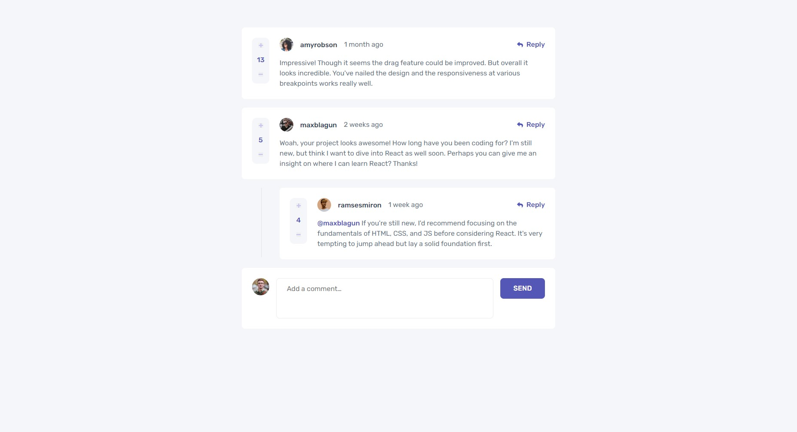

# Frontend Mentor - Interactive comments section solution

This is a solution to the [Interactive comments section challenge on Frontend Mentor](https://www.frontendmentor.io/challenges/interactive-comments-section-iG1RugEG9). Frontend Mentor challenges help you improve your coding skills by building realistic projects. 

## Table of contents

- [Overview](#overview)
  - [The challenge](#the-challenge)
  - [Screenshot](#screenshot)
  - [Links](#links)
- [My process](#my-process)
  - [Built with](#built-with)
  - [What I learned](#what-i-learned)
- [Author](#author)

**Note: Delete this note and update the table of contents based on what sections you keep.**

## Overview

### The challenge

Users should be able to:

- View the optimal layout for the app depending on their device's screen size
- See hover states for all interactive elements on the page
- Create, Read, Update, and Delete comments and replies
- Upvote and downvote comments
- **Bonus**: If you're building a purely front-end project, use `localStorage` to save the current state in the browser that persists when the browser is refreshed.

### Screenshot

### Links

- Solution URL: [frontendmentor.io](https://your-solution-url.com)
- Live Site URL: [Github pages](https://daniil034.github.io/interactive-comments-section-with-redux-state/)

## My process

### Built with

- Semantic HTML5 markup
- CSS custom properties
- Flexbox
- CSS Grid
- Mobile-first workflow
- [React](https://reactjs.org/) - JS library
- [Redux toolkit](https://redux-toolkit.js.org/) - A Predictable State Container for JS Apps

### What I learned

This was my first project where I used Redux for managing application's state. I found it quite useful in terms of sharing application's state between different components.

## Author

- Frontend Mentor - [@Daniil034](https://www.frontendmentor.io/profile/Daniil034)
